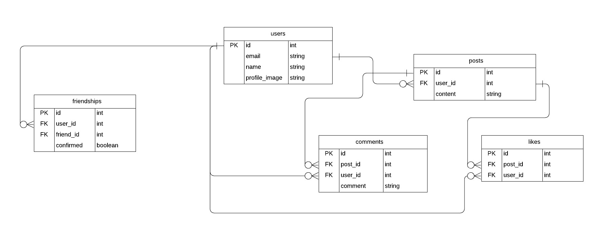

# Facebook Clone

## Project Description
Build Facebook! You’ll build a large portion of the core Facebook user functionality in this project. Details [here](https://www.theodinproject.com/courses/ruby-on-rails/lessons/final-project#assignment)

Additional description about the project and its features.

## Entity Relationship Diagram (ERD)
  The representation of data architecture for the facebook clone project.

  

  	
  

## Built With

- Ruby,
- Rails,
- technologies used

## Live Demo

[Live Demo Link](https://pacific-hamlet-16676.herokuapp.com/)

## Getting Started

**This is an example of how you may give instructions on setting up your project locally.**
**Modify this file to match your project, remove sections that don't apply. For example: delete the testing section if the currect project doesn't require testing.**

To get a local copy up and running follow these simple example steps.

### Prerequisites

### Setup

### Install

### Usage

### Run tests

### Deployment

## Authors

👤 **Author1**

- Github: [@githubhandle](https://github.com/githubhandle)
- Twitter: [@twitterhandle](https://twitter.com/twitterhandle)
- Linkedin: [linkedin](https://linkedin.com/linkedinhandle)

## 🤝 Contributing

Contributions, issues and feature requests are welcome!

Feel free to check the [issues page](issues/).

## Show your support

Give a ⭐️ if you like this project!

## Acknowledgments

- Hat tip to anyone whose code was used
- Inspiration
- etc

## 📝 License

This project is [MIT](lic.url) licensed.
